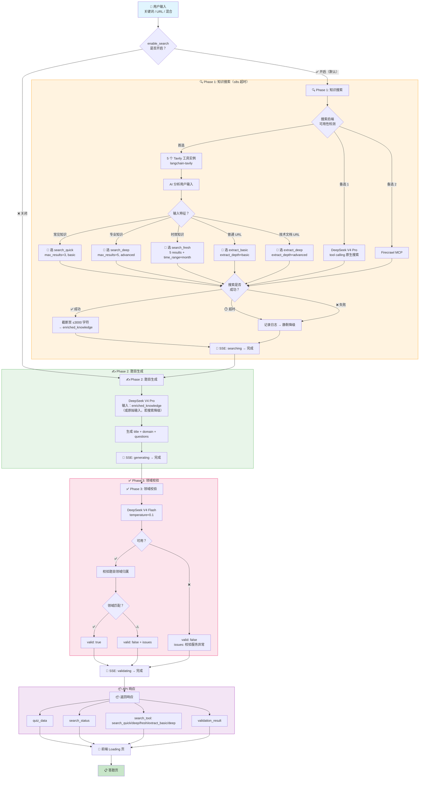
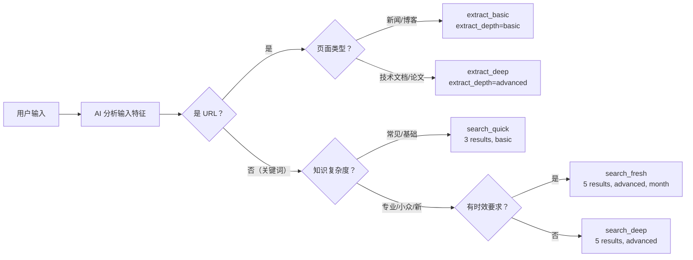
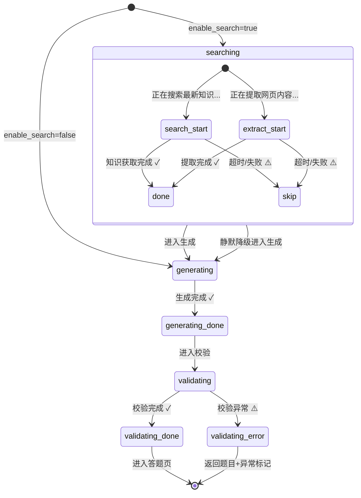

# 优化 AI 出题 — 业务流程图

## 总体流程

## 多实例工具 — AI 选择逻辑

## 5 个工具实例速查

| 工具名 | 类型 | 固化参数 | AI 调用示例 |
|--------|------|---------|-----------|
| `search_quick` | TavilySearch | `max_results=3`, `search_depth="basic"` | `search_quick({query: "Python 变量"})` |
| `search_deep` | TavilySearch | `max_results=5`, `search_depth="advanced"` | `search_deep({query: "Harness Engineering CI/CD"})` |
| `search_fresh` | TavilySearch | `max_results=5`, `search_depth="advanced"`, `time_range="month"` | `search_fresh({query: "2026 AI 趋势"})` |
| `extract_basic` | TavilyExtract | `extract_depth="basic"` | `extract_basic({urls: ["https://news.example.com"]})` |
| `extract_deep` | TavilyExtract | `extract_depth="advanced"` | `extract_deep({urls: ["https://arxiv.org/..."]})` |

## 前端 Loading 页状态机

